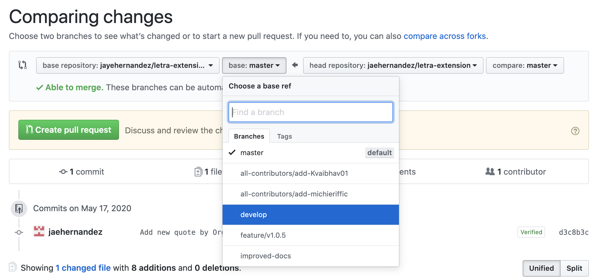

# 🗒 What the Fork? (Contributing Guidelines)

> A simple guide on how to contribute to this project, from start to end! Also did you get the pun? I love The Good Place.

Is this your first time contributing to open source? No worries, here's a simple guide to help you out! If you get stuck on a step, please don't hesitate to ask me. :)

You can contribute in two ways, whichever is more convinient for you:
1. Via Github Website _(no need to download anything!)_
2. Via Local Machine

## 1️⃣ Via Github Website
1. Check the **Issues page** to choose what you want to contribute on!

2. Click on **Fork** on the upper right hand of the screen.

> ☁️ Forking a Repository allows you to have your own copy of the repository. This is the best practice for contributing to open source projects.

3. Once the repo is forked, you'll be redirected to the newly created repository. You should see **forked from jayehernandez / letra-extension**.

4. You can now make changes to this repository, depending on what issues you chose to take on. 👩🏻‍💻👨🏻‍💻

5. When you're finished which the changes, you'll see that your repository is ahead of some commits from the main repository. Click on **Pull Request** to start creating a pull request (PR).

> ☁️ Pull Requests allow maintainers of a project to review your code and merge it to the main repository afterwards.

6. You'll be able to choose which branch you'd like to compare with. Make sure you choose the **develop** branch.

> ☁️ Pull Requests pointing to master will not be accepted. The master branch is all the code that is currently published in the Chrome Web Store.

7. After selecting the correct branch, you'll be able to click on **Create pull request**.

8. You'll be able to edit the title and description of your pull request before actually creating the pull request. If you are referencing an open issue, please reference it here. 

9. Hooray! You successfully created a PR for Letra! I'll be reviewing the changes you created and if everything is okay, your changes will be merged. 🥳

## 2️⃣ Via Local Machine
 
🚧 Guide coming soon! 🔜
