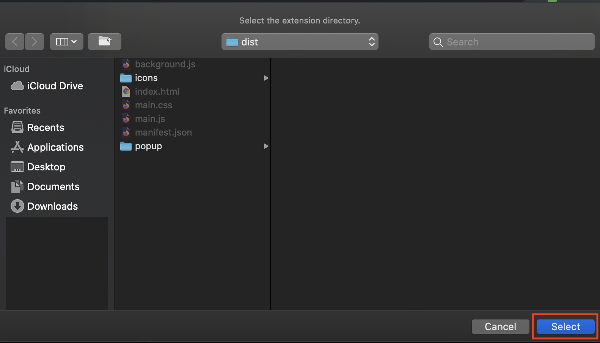

# ⚙️ Installation Guidelines

> A simple guide on how to install this project on your local machine!

## ⚠️ Prerequites, heads up, and all that Jazz
- You will need to have [Google Chrome](https://google.com/chrome/) installed (it's a Chrome extension 🤣)

- Also, make sure that you have **Node.js** and **npm** installed. [Here's a handy guide from the npm site!](https://www.npmjs.com/get-npm)

- These external APIs will **not** work on your local machine, since I can't possible share the production API keys 🔑 with everyone:
> - Unsplash (so you won't get to see a background image 😢)
> - ResponsiveVoice (no text-to-speech for the chosen word!)

- Make sure you have the repository in your local machine! You can go to the [Contributing Guidelines](https://github.com/jayehernandez/letra-extension/blob/improved-docs/docs/how_to_contribute.md) for steps on how to fork this repo.

## 1️⃣ Setup Node.js server

The Node.js server is where we'll be getting the word for the day, and the supported languages.

1. Go to the `server` folder.
```
cd server
```

2. Create a `.env` file so that we can set the port to `3100`.
```
echo "PORT=3100" >> .env
```

3. Install dependencies needed for this project.
```
npm install
```

4. Start the server!
```
npm start
```

5. If you see something like this in your console, that means you're good to go! ✨ **Do not close this terminal.**
```
> letra@1.0.0 start {{ serverFilePathHere }}
> node server.js
```

## 2️⃣ Setup Vue.js

This is what we'll be using for the frontend of the site.

1. Open a new terminal. Do not use the same one from the Node.js setup. Navigate to `client` folder.
```
cd client
```

2. Create a `.env` file and set the API url to `http://localhost:3100`. This will enable us to connect our Vue app to the NodeJS server.
```
echo "VUE_APP_API_URL=http://localhost:3100" >> .env
```

3. Same as in the first part, we'll need to install dependencies.
```
npm install
```

4. Since we need the `dist` folder for the extension, we'll need to watch any file changes. **Do not close this terminal.**
```
npm run watch:dev
```

5. If you see something like this, you're good to go!!
```
[ Starting the Hot Extension Reload Server... ]

webpack is watching the files…
```

## 3️⃣ Run on Google Chrome

Final steps!! 🏃🏽‍♂️ We'll just need to setup our browser to allow development of Chrome extensions.

1. Open Google Chrome. Click on the three dots at the upper right of the screen. Then click on `More Tools` -> `Extensions`.


2. You should now be in the **Extensions** page. Enable **Developer Mode** by clicking on the switch at the upper right of the screen.


3. We need to load the compiled files (from Vue.js above) to Chrome. We'll do this by clicking on `Load unpacked`.


4. Navigate to where your `letra-extension` repository is. Go to `client -> dist` and select this folder.


5. The extension should now be loaded on the page! 🎉 You can test it by well, opening a new tab.


> Let me know if any of these steps are unclear! I'd be happy to help out in setting up your local copy.
