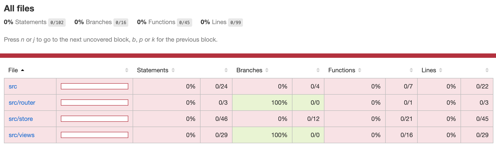
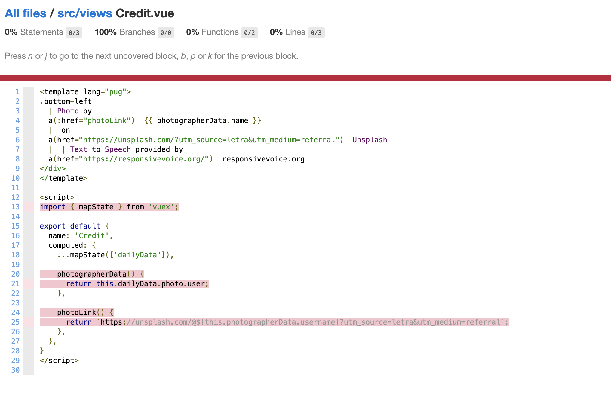

# ⚙️ Testing Guidelines

## ⚠️ Some things to take note of
- Make sure that you have a copy of this repository. Please **fork** this to do so. Step by step instructions can be found [here](https://github.com/jayehernandez/letra-extension/blob/master/docs/how_to_contribute.md).
- Here's a [guide](https://github.com/jayehernandez/letra-extension/blob/master/docs/how_to_install.md) on how to install this Chrome extension on your local machine, if you would like to see it in action.

## 📝 Notes about Tests and Jest

### Writing Tests
- All test files are inside the `test` folder of either directory.

- To add a new test file, you can create a new file under the `test` folder with the following format:
  ```
  {{ filename }}.test.js
  ```

  > ☁️ Do **not** forget to add the `.test.js`. If you simply adding `.js`, Jest will not be able to recognize this file.

- Please use the **ES6** syntax in writing your test files. Some pages to visit if you haven't used ES6:
  - [Javascript ES6 - write less, do more](https://www.freecodecamp.org/news/write-less-do-more-with-javascript-es6-5fd4a8e50ee2) by [freecodecamp.org](https://www.freecodecamp.org/)
  - [ES6 Syntax and Feature Overview](https://www.taniarascia.com/es6-syntax-and-feature-overview/) by [Tania Rascia](https://www.taniarascia.com/)

- Some sample tests are provided in the file `example.test.js`. Thanks [@tbarland77](https://github.com/tbarland77) for this. You can look at this (and the other files inside `test`) if you are just starting out with Jest.

- Please create **tests with value**. A test like the one below, while good as an example, is not really something we *need* to test out since it's obvious.
  ```
  describe('example', () => {
    it('runs a example test and passes', () => {
      expect(1 + 1).toEqual(2);
    });
  });
  ```
  > ☁️ Check out items that do not have tests yet with the [test coverage](#seeing-test-coverage).

- If you have no experience with Jest yet, I highly suggest looking for tutorials on it.  Here are some to get you started (these helped me out too):
  - [Unit Testing -- VueJS](https://vuejs.org/v2/guide/unit-testing.html) by [Vue.js](https://vuejs.org/)
  - [Testing Vue with Jest](https://www.digitalocean.com/community/tutorials/vuejs-testing-vue-with-jest) by [DigitalOcean](https://www.digitalocean.com/)
  - [Using Jest to test your Node.js application](https://dimitr.im/jest-test-nodejs) by [Dimitri](https://dimitr.im/)

  > ☁️ You can use this repository to practice!

### Running Tests
- You can run all tests in either the `client` or `server` directories with this command:
  ```
  npm test
  ```

- You can run a **single** file with:
  ```
  npm test {{ filename }}
  npm test example.test.js
  ```

### Seeing Test Coverage
Running `npm test` on it's own gives a nice summary on its own, but if you would like a more detailed version, you can open the `coverage/index.html` file in either directories.

Upon opening that in the browser, you should see something like this:



> ☁️ It's bloody red right now since testing was just added (June 2020), but if you would like to help in this repo having **100% test coverage**, please check out this [issue](https://github.com/jayehernandez/letra-extension/issues/125).

If you click on one file, this actually highlights the **untested code**. You can use this to decide on what tests you want to do!



## ❓ Troubleshooting

### TypeError _vm(...).compileFunction is not a function

```
> jest

 FAIL  test/example.test.js
  ● Test suite failed to run

    TypeError: (0 , _vm(...).compileFunction) is not a function

      at Runtime._execModule (node_modules/jest-runtime/build/index.js:1166:56)

```

If you encounter something like this when running `npm run test`, make sure that your node version (`node -v`) is `v.12.18.0` (latest stable version as of writing) or above.

I myself encountered this as my node version was just `v.10.4.0`. This was first documented in this [issue](https://github.com/jayehernandez/letra-extension/issues/125). [Here's](https://phoenixnap.com/kb/update-node-js-version) an article to help you out in updating your node version.